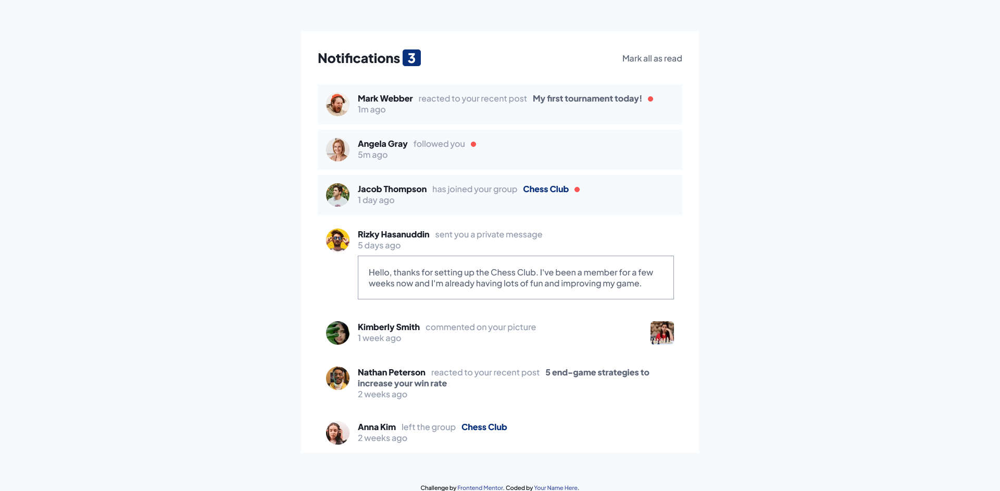
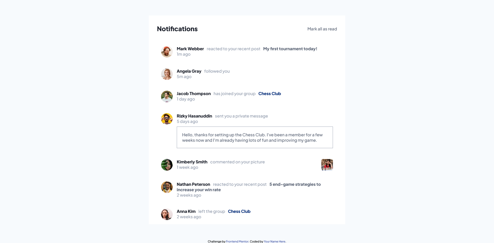

# Frontend Mentor - Notifications page solution

This is a solution to the [Notifications page challenge on Frontend Mentor](https://www.frontendmentor.io/challenges/notifications-page-DqK5QAmKbC). Frontend Mentor challenges help you improve your coding skills by building realistic projects. 

## Table of contents

- [Overview](#overview)
  - [The challenge](#the-challenge)
  - [Screenshot](#screenshot)
  - [Links](#links)
- [My process](#my-process)
  - [Built with](#built-with)
  - [What I learned](#what-i-learned)
  - [Useful resources](#useful-resources)
- [Author](#author)

## Overview

### The challenge

Users should be able to:

- Distinguish between "unread" and "read" notifications
- Select "Mark all as read" to toggle the visual state of the unread notifications and set the number of unread messages to zero
- View the optimal layout for the interface depending on their device's screen size
- See hover and focus states for all interactive elements on the page

### Screenshot




### Links

- [Solution](https://www.frontendmentor.io/solutions/notification-page-mark-all-read-with-forof-loop-nHAGhSU5hR)
- [Live Site](https://wishba.github.io/notifications-page/#)

## My process

### Built with

- Semantic HTML5 markup
- CSS custom properties

### What I learned

- [htmlcollection](https://www.w3schools.com/jsreF/dom_obj_htmlcollection.asp) properties and method are:

  - length()
  - item()
  - namedItem()

  but can use more properties and method if it used with loop.

  example in this project:

  ```js
  function markAllRead() {
    let notification = document.getElementsByClassName('notification')
    for (const iterator of notification) {
      iterator.classList.remove("notification--unread")
    }
  }
  ```

- ::after selector can display a background with empty content, but the size is need to be defined and the display needs to be a block or inline-block

  example in this project:

  ```css
  .notification__head::after {
    content: '';
    width: 10px;
    height: 10px;
    border-radius: 50%;
    background: var(--red);
    display: inline-block;
  }
  ```

### Useful resources

- [w3schools - htmlcollection](https://www.w3schools.com/jsreF/dom_obj_htmlcollection.asp)
- [w3schools - classList](https://www.w3schools.com/jsref/prop_element_classlist.asp)

## Author

- Frontend Mentor - [@wishba](https://www.frontendmentor.io/profile/wishba)
- Twitter - [@wishba_](https://twitter.com/wishba_)